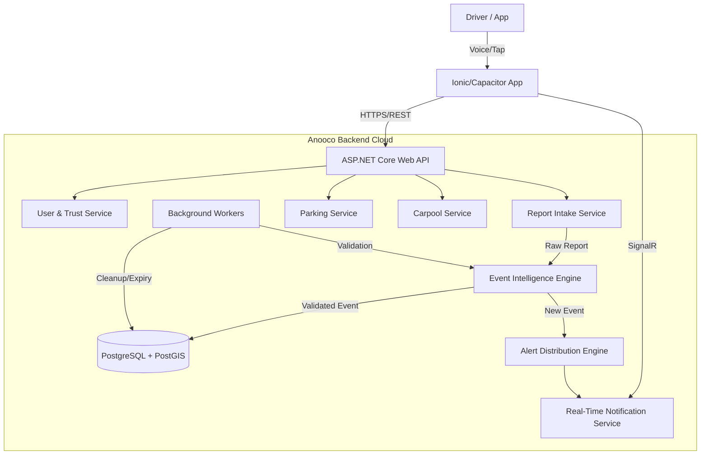

# Anooco System Architecture

## Overview
Anooco is a voice-first, AI-powered road intelligence platform designed to replace unsafe chat groups with structured, real-time events. The system is built on a Clean Architecture principle, ensuring modularity, scalability, and testability.

## High-Level Architecture

## Core Components

### 1. Frontend (Mobile App)
- **Framework:** Ionic (Angular) + Capacitor.
- **Responsibilities:**
  - Voice Command Capture (Native STT).
  - TTS for Announcements.
  - Background Geolocation Tracking.
  - Minimalist UI (No maps-first interface).
  - Offline buffering of reports.

### 2. Backend API (ASP.NET Core)
- **Framework:** .NET 8 Web API.
- **Architecture:** Clean Architecture (Domain, Application, Infrastructure, API layers).
- **Responsibilities:**
  - RESTful endpoints for resource management.
  - SignalR Hubs for real-time alerts.
  - Authentication & Authorization.

### 3. Services (Domain Logic)
- **User & Trust Service:** Manages user profiles and calculates dynamic trust scores based on report accuracy.
- **Report Intake Service:** Receives raw voice transcripts/inputs, parses intent, and normalizes data.
- **Event Intelligence Engine:** 
  - Clusters nearby reports (DBSCAN or similar).
  - Validates events based on user trust scores.
  - Merges duplicate reports into single "Events".
- **Alert Distribution Engine:** 
  - Determines which users need to know about an event based on location (Geofencing) and vector (Direction).
  - Pushes audio-ready payloads to clients.
- **Parking & Carpool Services:** Specialized logic for resource sharing.

### 4. Database (Persistence)
- **Technology:** PostgreSQL 16+ with PostGIS.
- **Role:** 
  - Spatial indexing for fast "Who is nearby?" queries.
  - Storage of users, reports, events, and reputation logs.

## Data Flow

1. **Ingestion:** User speaks "Anooco, pothole here". App converts STT -> Text + Location + Timestamp -> Sends to API.
2. **Processing:** `Report Intake Service` parses intent ("Road Damage"). `Event Intelligence Engine` checks for existing events within X meters.
3. **Clustering:**
   - *Scenario A (New):* Creates a new Event.
   - *Scenario B (Existing):* Adds confirmation to existing Event, updates confidence score.
4. **Validation:** If Event Confidence > Threshold, mark as `Confirmed`. Update Reporter's Trust Score.
5. **Distribution:** `Alert Distribution Engine` queries active users within Radius R moving towards the event.
6. **Delivery:** SignalR pushes payload. App plays TTS: "Caution, pothole reported 500 meters ahead."

## Technology Constraints & Decisions
- **Privacy-First:** Location data is ephemeral for alerting; historical traces are anonymized or discarded.
- **Battery-Efficient:** Background tracking uses significant change/geofence triggers rather than constant GPS polling.
- **Modular:** Services are loosely coupled to allow independent scaling (e.g., scaling the Alert Engine separately during rush hour).
