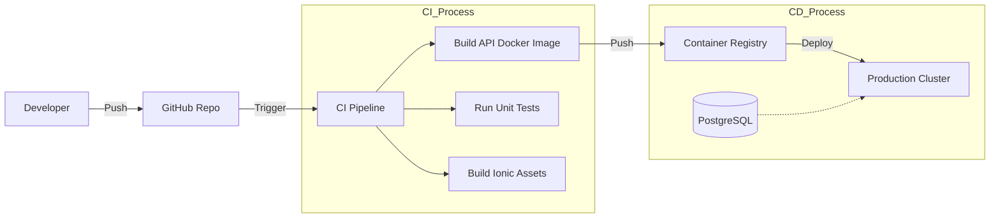

# Anooco Deployment Strategy

## 1. Infrastructure (Cloud - AWS/Azure)

### Database (PostgreSQL + PostGIS)
- **Managed Service:** AWS RDS for PostgreSQL or Azure Database for PostgreSQL.
- **Configuration:** 
  - Version: 16+
  - Extensions: PostGIS enabled.
  - Multi-AZ for high availability.
  - Backups: Daily automated snapshots.

### Backend (ASP.NET Core API)
- **Containerization:** Docker.
- **Orchestration:** Kubernetes (EKS/AKS) or Azure App Service for Containers.
- **Scaling:** Horizontal Pod Autoscaling (HPA) based on CPU/Memory and Request Count.
- **CI/CD:** GitHub Actions / Azure DevOps pipelines to build Docker image and push to ECR/ACR.

### Real-Time (SignalR)
- **Scaling:** Use Azure SignalR Service or Redis Backplane for sticky sessions if self-hosted in K8s.

## 2. Mobile App (Ionic/Capacitor)

### Build Process
1. **Lint & Test:** Run unit tests.
2. **Build Web Assets:** `ionic build --prod`.
3. **Sync Native:** `npx cap sync`.
4. **Compile Native:**
   - **Android:** Gradle build -> APK/AAB.
   - **iOS:** Xcode build -> IPA.

### Distribution
- **Alpha/Beta:** TestFlight (iOS) and Google Play Internal Testing (Android).
- **Production:** App Store and Google Play Store.
- **OTA Updates:** Use Ionic Appflow (optional) for pushing JS/HTML/CSS updates without app store review.

## 3. DevOps Pipeline

## 4. Monitoring & Observability
- **Logs:** ELK Stack (Elasticsearch, Logstash, Kibana) or Azure Monitor.
- **Metrics:** Prometheus + Grafana (Track active users, report ingestion rate, latency).
- **Tracing:** OpenTelemetry for tracking requests across microservices.

## 5. Security Checklist
- [ ] SSL/TLS everywhere (HTTPS + WSS).
- [ ] API Key / JWT Authentication for all endpoints.
- [ ] Database firewall rules (allow only K8s cluster IP).
- [ ] Regular vulnerability scanning of Docker images.
